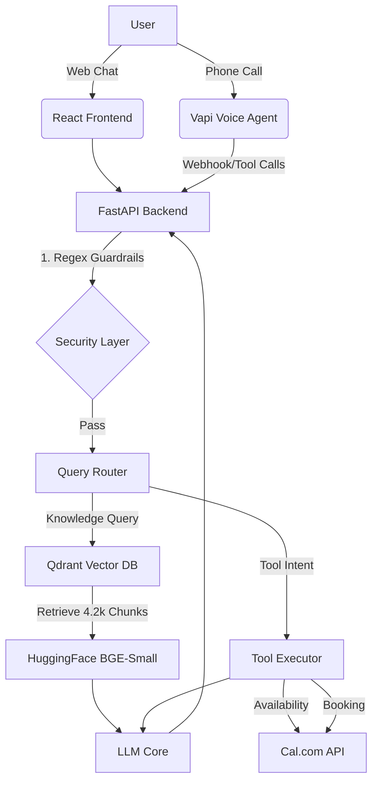

# 🤖 Diablo - Autonomous Personal AI Agent

> **An end-to-end Voice & Chat AI Persona for Linga Seetha Rama Raghavendra**

Diablo is an autonomous agent designed to handle inbound technical interviews, discuss my background, analyze my GitHub repositories, and independently schedule meetings via my live calendar.

---

## 🏗️ System Architecture

The system uses a **CRAG (Corrective Retrieval-Augmented Generation)** architecture connected to a React frontend and a Vapi.ai voice interface.



## 🚀 Setup Instructions

### 1. Prerequisites
- Python 3.10+
- Node.js v18+
- Accounts for: HuggingFace, Qdrant, Cal.com

### 2. Backend Setup
```bash
cd backend
python -m venv venv
source venv/bin/activate
pip install -r requirements.txt

# Create .env file with your API keys
cp .env.example .env

# Run data ingestion pipeline (RAG)
python ingest.py

# Start the server
uvicorn main:app --host 0.0.0.0 --port 8000
```

### 3. Frontend Setup
```bash
cd chat-ui
npm install
npm run dev
```

## 💰 Cost Breakdown

This architecture is aggressively optimized for cost by leveraging open-source embedding models and efficient vector storage.

### Per Web Chat Session (~10 turns)
- **Embeddings (BAAI/bge-small-en-v1.5):** $0.00 (Self-hosted/Free tier)
- **Vector DB (Qdrant Cloud):** $0.00 (Free cluster)
- **LLM Token Costs:** ~$0.005
- **Total Chat Cost:** **~$0.005 per session**

### Per Voice Call (~5 minutes)
- **Vapi.ai (Transport/STT/TTS):** ~$0.05 / min
- **LLM Token Costs:** ~$0.02
- **Total Voice Cost:** **~$0.27 per call**

---
*Built for the Scaler AI Engineer Screening Assignment.*
