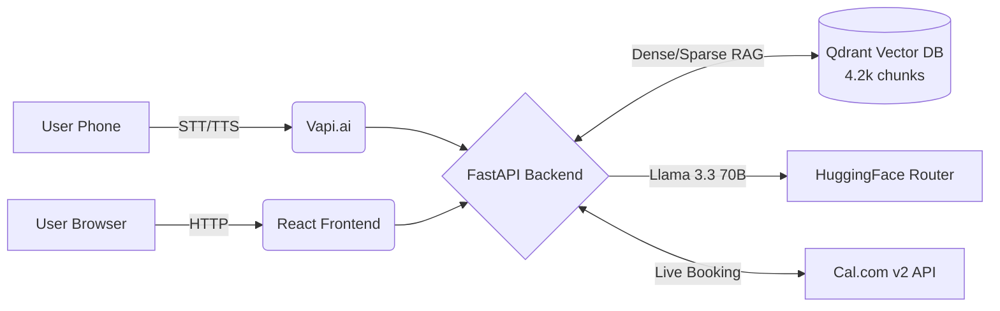

<div align="center">
  <h1>🦀 Diablo AI Agent</h1>
  <p><strong>The autonomous voice-and-chat AI persona for Linga Seetha Rama Raghavendra</strong></p>

  [](https://www.python.org/downloads/)
  [](https://fastapi.tiangolo.com)
  [](https://reactjs.org/)
  [](https://raghav-1729-diablo-ai-agent.hf.space)
</div>

---

**Diablo** is a fully autonomous, production-ready AI agent representing Linga, an AI Engineer based in Bengaluru. It handles technical Q&A about his 24+ GitHub repositories and resume using a custom RAG pipeline, and seamlessly schedules interviews directly on his live Cal.com calendar—all with zero human intervention.

🌐 **Live Demo:** [raghav-1729-diablo-ai-agent.hf.space](https://raghav-1729-diablo-ai-agent.hf.space)

---

## ✨ Key Features

- 🎙️ **Voice Agent (Vapi)** — Call the live phone number. Diablo handles human interruptions, synthesizes natural responses, checks live calendar availability, and completes complex 2-step booking flows entirely over voice.
- 💬 **Web Chat Interface** — A sleek React UI for deep dives into Linga's background (BITS Pilani, Scaler) and 21+ technical projects. Every answer is evidence-backed via hybrid dense/sparse retrieval.
- 📅 **Live Cal.com Integration** — Direct integration with Cal.com v2. Proposes available slots, validates email formats (correcting messy STT inputs), and finalizes real calendar bookings.
- 🛡️ **Ironclad Guardrails** — Enterprise-grade protections against prompt injections, jailbreaks, and off-topic queries. Diablo strictly discusses qualifications and scheduling.

---

## 🏗️ Architecture



**Execution Pipeline:**  
`Guardrails` ➜ `Query Rewriting` ➜ `Intent Classification (Voice)` ➜ `Hybrid Retrieval` ➜ `LLM Tool Dispatch` ➜ `Response`

---

## 🚀 Enterprise Robustness

- **⚡ Intent-Based Retrieval Bypass:** Voice interactions instantly bypass the Qdrant retrieval step for short conversational turns (e.g., *"yes"*, *"book tomorrow"*), slashing latency to ~1 second.
- **📧 Eager Email Normalization:** Fixes messy Speech-to-Text artifacts from voice calls (e.g., *"john hyphen doe at company dot com"* becomes `john-doe@company.com`) before the LLM even sees the command.
- **🚦 Vapi-Optimized Rate Limiting:** Global in-flight locks are intentionally bypassed to support natural Vapi barge-ins (overlapping voice interruptions), while a sliding-window rate limit safely blocks API abuse scripts without dropping live callers.
- **⏱️ Dynamic Timeouts:** Web chat has a full 25-second LLM timeout to allow deep reasoning, while Voice uses a strict 10-second timeout per tool hop (with graceful filler fallbacks) to prevent Vapi from severing connections during complex tasks.
- **✅ Strict Pre-Validation:** Calendar parameters (future dates, strict times, regex-validated emails) are locally sanitized *before* hitting the Cal.com API to prevent silent scheduling failures.
- **🧪 Extensive Test Coverage:** Bulletproofed by 43 unit tests and a rigorous suite of 50 E2E LLM interactions testing strict Hallucination bounds and adversarial attacks.

---

## ⚡ Performance & Latency

*Measured from the deployed Hugging Face Space (warm state).*

| Interaction | Avg Latency | Details |
| :--- | :--- | :--- |
| **Health Ping** | `1.0s` | Basic backend health check. |
| **Voice Greeting** | `2.0s` | 1 LLM inference call, no tool dispatches. |
| **Voice Availability** | `3.8s` | 2 LLM calls (tool check + voice synthesis). |
| **Voice Booking** | `4.2s` | Eager email normalization + 2 LLM calls. |

*Note: Vapi uses token streaming, so the first-token-to-audio latency is significantly lower than the total turnaround times listed above.*

---

## 💻 Local Setup & Development

### 1. Backend (FastAPI + Qdrant)
```bash
cd backend
python -m venv venv && source venv/bin/activate
pip install -r requirements.txt

# Configure your environment
cp .env.example .env
# Edit .env and add HF_TOKEN, CAL_API_KEY, QDRANT_URL

# Index resume + GitHub repos into Qdrant
python ingest.py

# Start the server
uvicorn main:app --host 0.0.0.0 --port 8000
```

### 2. Frontend (React + Vite)
```bash
cd chat-ui
npm install
npm run dev
```

*Requirements: Python 3.10+, Node.js 18+, and active accounts on Hugging Face, Qdrant Cloud, Cal.com, and Vapi.ai.*

---

## 📂 Project Structure

```text
backend/src/
├── api/           # FastAPI routes, Pydantic schemas, Dependency Injection
├── llm/           # Async OpenAI client wrappers, Output parsing & sanitization
├── prompts/       # Channel-specific persona templates (Voice vs Web)
├── tools/         # Cal.com integration, RAG knowledge search, Dynamic tool dispatcher
├── utils/         # Eager Email Normalizer, Regex Guardrails
├── retrieval/     # Hybrid dense+sparse retrieval engines
├── embeddings/    # BGE-small embeddings configuration, BM25 indices
├── chunking/      # Advanced recursive text splitters
├── ingestion/     # Data loaders for Linga's Resume and GitHub Repos
└── vectordb/      # Qdrant client interactions
```

---

<div align="center">
  <i>Built from the ground up for the Scaler AI Engineer Screening Assignment.</i>
</div>
